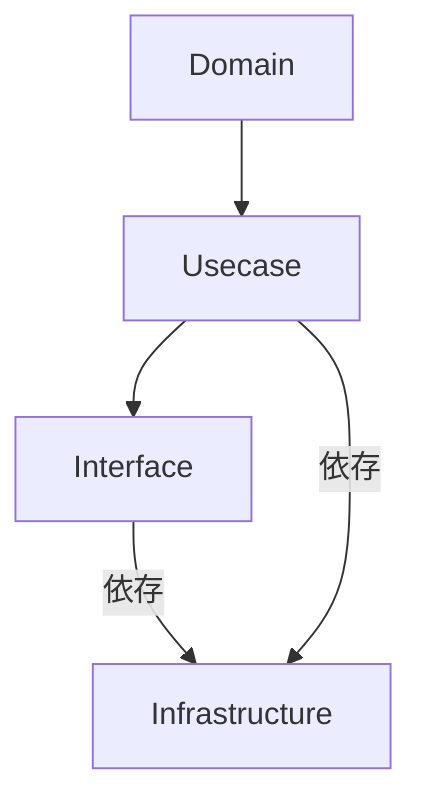

# アーキテクチャ概要

本プロジェクトはクリーンアーキテクチャに基づき以下の 4 層で構成されています。

## レイヤー構成

1. **Domain 層**
   - エンティティやリポジトリのインターフェースを定義します。
2. **Usecase 層**
   - ドメインモデルを利用したアプリケーション固有のビジネスルールを実装します。
3. **Interface 層**
   - Flask のコントローラーやテンプレートなど UI との接点を扱います。
4. **Infrastructure 層**
   - SQLite へのアクセスやパスワードハッシュ化など外部ライブラリへの依存をまとめます。

## 依存関係図

内向きの依存のみを許可し、外側の層から内側の層を直接参照しない構造となっています。
